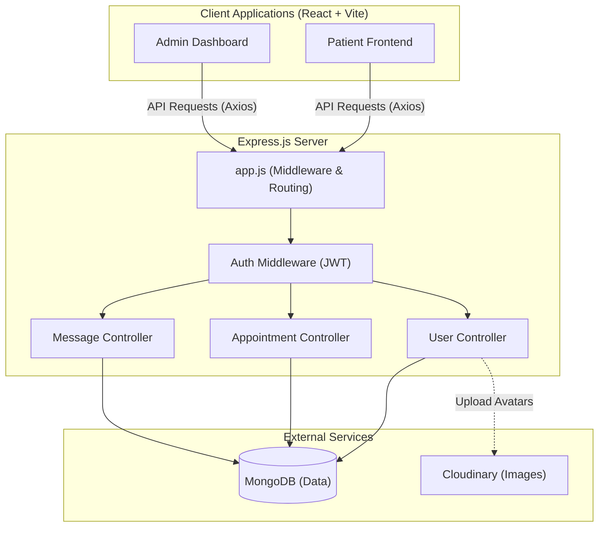

# Medi-Appoint
Medi-Appoint is a full-stack web application built using React.js, Node.js, Express.js, and MongoDB. It allows patients to register, log in, book appointments, search medicines, and contact the hospital. The system uses JWT authentication for secure login and follows a structured frontend-backend architecture for smooth data flow and management.

This repository, **Medi-Appoint**, is a comprehensive MERN (MongoDB, Express, React, Node.js) stack application designed for hospital management. It provides a multi-role ecosystem where patients, doctors, and administrators can interact through a unified backend system. The project is split into three primary sub-projects: a server-side API, a patient-facing frontend, and an administrative dashboard.

## 1. What is this repo?

The **Medi-Appoint** repository serves as a full-stack solution for handling healthcare-related workflows, primarily focusing on appointment scheduling and user management. According to the `README.md`, its core functionality allows patients to register, log in, search for medicines, contact the hospital, and book appointments. 

The system distinguishes between three distinct user roles:
1.  **Patient:** Users who can create accounts and request appointments with specific doctors in various departments.
2.  **Doctor:** Specialized users who belong to specific departments (e.g., Cardiology, Orthopedics) and are assigned to appointments.
3.  **Admin:** Power users who manage the system, approve or reject appointments, add new doctors, and view messages from the contact form.

A key architectural feature of this repository is its dual-frontend approach. Instead of a single application with conditional rendering, the codebase contains two separate React applications built with Vite: 
*   A "Frontend" located in `MERN-Stack-Hospital-Management-System-Web-Application-main/frontend/` for public-facing patient interactions.
*   A "Dashboard" located in `MERN-Stack-Hospital-Management-System-Web-Application-main/dashboard/` for administrative oversight.

The backend, located in `MERN-Stack-Hospital-Management-System-Web-Application-main/backend/`, acts as the central hub, managing data persistence in MongoDB, handling image uploads via Cloudinary, and securing routes with JSON Web Tokens (JWT) stored in HTTP-only cookies.

## 2. How all main components connect

The architecture follows a standard client-server model where two distinct React clients communicate with a single Express.js REST API. 

### Data Flow and Interaction
1.  **Authentication and Authorization:** The system uses `jsonwebtoken` (JWT) for session management. When a user logs in via `MERN-Stack-Hospital-Management-System-Web-Application-main/backend/controller/userController.js`, a token is generated and sent to the client as a cookie. The backend uses custom middleware in `MERN-Stack-Hospital-Management-System-Web-Application-main/backend/middlewares/auth.js` to verify if a user is an authenticated Admin or Patient before granting access to specific API routes.
2.  **API Gateway Logic:** The entry point for the backend is `MERN-Stack-Hospital-Management-System-Web-Application-main/backend/app.js`. It configures CORS (Cross-Origin Resource Sharing) to allow requests from both the patient frontend and the admin dashboard. It routes requests to three main routers: `userRouter.js`, `appointmentRouter.js`, and `messageRouter.js`.
3.  **Persistence Layer:** The backend interacts with MongoDB using Mongoose. Schemas defined in `MERN-Stack-Hospital-Management-System-Web-Application-main/backend/models/` enforce data integrity. For instance, `userSchema.js` handles password hashing using `bcrypt` before saving a user to the database.
4.  **External Services:** The application integrates with Cloudinary to store and serve images, such as doctor avatars. The configuration for this is handled in `MERN-Stack-Hospital-Management-System-Web-Application-main/backend/server.js`.

### Component Connection Diagram



## 3. Repository Structure

```shell
Medi-Appoint/
├── MERN-Stack-Hospital-Management-System-Web-Application-main/
│   ├── backend/
│   │   ├── controller/
│   │   │   ├── appointmentController.js
│   │   │   ├── messageController.js
│   │   │   └── userController.js
│   │   ├── database/
│   │   │   └── dbConnection.js
│   │   ├── middlewares/
│   │   │   ├── auth.js
│   │   │   ├── catchAsyncErrors.js
│   │   │   └── error.js
│   │   ├── models/
│   │   │   ├── appointmentSchema.js
│   │   │   ├── messageSchema.js
│   │   │   └── userSchema.js
│   │   ├── router/
│   │   │   ├── appointmentRouter.js
│   │   │   ├── messageRouter.js
│   │   │   └── userRouter.js
│   │   ├── utils/
│   │   │   └── jwtToken.js
│   │   ├── app.js
│   │   ├── server.js
│   │   └── package.json
│   ├── dashboard/
│   │   ├── src/
│   │   │   ├── components/ (Dashboard, Login, Sidebar, etc.)
│   │   │   ├── App.jsx
│   │   │   └── main.jsx
│   │   ├── index.html
│   │   └── package.json
│   └── frontend/
│       ├── src/
│       │   ├── Pages/ (Home, Appointment, Register, etc.)
│       │   ├── components/ (Navbar, Footer, Hero, etc.)
│       │   ├── App.jsx
│       │   └── main.jsx
│       ├── index.html
│       └── package.json
└── README.md
```

## 4. Other important information

### Technical Stack Details
*   **Frontend & Dashboard:** Built using **React 18** and **Vite**. They utilize `axios` for HTTP requests to the backend and `react-router-dom` for client-side navigation. Styling is handled via standard CSS, with specific layouts for the administrative sidebar and the patient landing page.
*   **Backend:** Powered by **Node.js** and **Express**. It uses `express-fileupload` to handle multipart/form-data (required for doctor avatars) and `cookie-parser` to manage JWTs stored in cookies for enhanced security against XSS.
*   **Database:** **MongoDB** via the Mongoose ODM. The database connection logic is isolated in `MERN-Stack-Hospital-Management-System-Web-Application-main/backend/database/dbConnection.js`.

### Key Features and Implementation Specifics
1.  **Validation:** The backend uses the `validator` library within Mongoose schemas (e.g., in `MERN-Stack-Hospital-Management-System-Web-Application-main/backend/models/userSchema.js`) to ensure emails are correctly formatted and fields like NIC (National Identity Card) or phone numbers meet specific character lengths.
2.  **Global Error Handling:** The repository implements a robust error handling system. `MERN-Stack-Hospital-Management-System-Web-Application-main/backend/middlewares/error.js` defines a central middleware to catch and format errors, while `catchAsyncErrors.js` is a wrapper used in controllers to handle rejected promises without repetitive try-catch blocks.
3.  **Role-Based Access Control (RBAC):** In `MERN-Stack-Hospital-Management-System-Web-Application-main/backend/router/appointmentRouter.js`, routes are protected differently. For example, `router.post("/post", isPatientAuthenticated, postAppointment)` ensures only patients can book, while `router.get("/getall", isAdminAuthenticated, getAllAppointments)` ensures only admins can see the full list.
4.  **Configuration Quirk:** In `MERN-Stack-Hospital-Management-System-Web-Application-main/backend/server.js`, there is a hardcoded absolute file path for the `.env` file pointing to a specific local directory (`C:/Users/DELL/...`). A developer cloning this repo would need to modify this line to use a relative path like `dotenv.config({ path: "./.env" });` to make the application portable.

### Setup Requirements
To run this project, a developer needs to provide several environment variables in the `backend/.env` file:
*   `MONGO_URI`: The connection string for the MongoDB instance.
*   `PORT`: The port on which the server runs (defaults to 5000).
*   `JWT_SECRET_KEY` & `JWT_EXPIRES`: For token signing and expiration.
*   `CLOUDINARY_CLOUD_NAME`, `CLOUDINARY_API_KEY`, `CLOUDINARY_API_SECRET`: For the image hosting service.
*   `FRONTEND_URL_ONE` & `FRONTEND_URL_TWO`: To configure CORS for both the patient frontend and admin dashboard.
